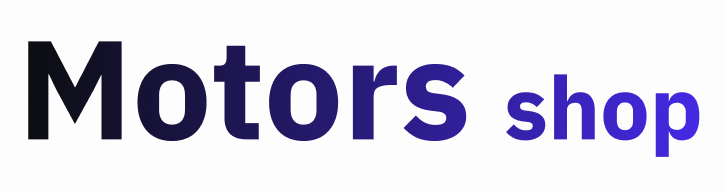

## Tabela de Conteúdos

- [Visão Geral](#1-visão-geral)
- [Início Rápido](#2-início-rápido)
  - [Pré-requisitos](#21-pré-requisitos)
  - [Instalando dependências](#22-instalando-dependências)
  - [Rodando a aplicação](#23-rodando-a-aplicação)

---

## 1. Visão Geral

[ Voltar para o topo ](#tabela-de-conteúdos)

Trata-se de uma aplicação front-end que utiliza a api [MotorShop Back](#https://github.com/m6-t14-grupo35/motor-shop-back) e é utilizada para a publicação de anúncios de veículos. A aplicação possui cadastro e login de usuários, podendo este ser um comprador ou anunciante. É possível visualizar os anúncios e filtrá-los, além de fazer comentários. O anunciante possui uma página com todos os seus anúncios e pode editá-los ou excluí-los. O usuário também consegue editar ou excluir seu perfil. A aplicação possui um layout clean e de fácil entendimento. As tecnologias utilizadas foram:

- [TypeScript](https://www.typescriptlang.org/)
- [Next](https://nextjs.org/)
- [Tailwind](https://tailwindcss.com/)
- [Zod](https://zod.dev/)
- [Axios](https://axios-http.com/ptbr/docs/intro)
- [Nookies](https://www.npmjs.com/package/nookies)

A URL base da aplicação é: XXXXXX

---

## 2. Início Rápido

[ Voltar para o topo ](#tabela-de-conteúdos)

### 2.1. Pré-requisitos

- [Node](https://nodejs.org/en):
  Recomenda-se utilizar a versão LTS mais recente do Node.js.

- [NPM](https://www.npmjs.com/) ou [Yarn](https://yarnpkg.com/):
  O projeto utiliza o NPM ou Yarn como gerenciador de pacotes.

- Dependências do projeto:  
  [@hookform/resolvers](https://www.npmjs.com/package/@hookform/resolvers): "^3.1.1",  
  [@types/node](https://www.npmjs.com/package/@types/node): "20.2.5",  
  [@types/react](https://www.npmjs.com/package/@types/react): "18.2.8",  
  [@types/react-dom](https://www.npmjs.com/package/@types/react-dom): "18.2.4",  
  [autoprefixer](https://www.npmjs.com/package/autoprefixer): "10.4.14",  
  [axios](https://axios-http.com/ptbr/docs/intro): "^1.4.0",  
  [eslint](https://www.npmjs.com/package/eslint): "8.42.0",  
  [eslint-config-next](https://www.npmjs.com/package/eslint-config-next): "13.4.4",  
  [next](https://nextjs.org/): "13.4.4",  
  [nookies](https://www.npmjs.com/package/nookies): "^2.5.2",  
  [postcss](https://postcss.org/): "8.4.24",  
  [react](https://react.dev/): "18.2.0",  
  [react-dom](https://www.npmjs.com/package/react-dom): "18.2.0",  
  [react-hook-form](https://react-hook-form.com/): "^7.45.0",  
  [react-icons](https://react-icons.github.io/react-icons/): "^4.9.0",  
  [react-router-dom](https://reactrouter.com/en/main): "^6.12.0",  
  [react-toastify](https://fkhadra.github.io/react-toastify/introduction): "^9.1.3",  
  [tailwindcss](https://tailwindcss.com/): "3.3.2",  
  [typescript](https://www.typescriptlang.org/): "5.1.3",  
  [zod](https://zod.dev/): "^3.21.4"

### 2.2. Instalando Dependências

Clone o projeto em sua máquina e instale as dependências com o comando:

```shell
npm install
```

### 2.3 Rodando a aplicação

Para rodar a aplicação, utilize o comando:

```
npm run dev
```

Em seguida, acesse seu navegador em: http://localhost:3000/
